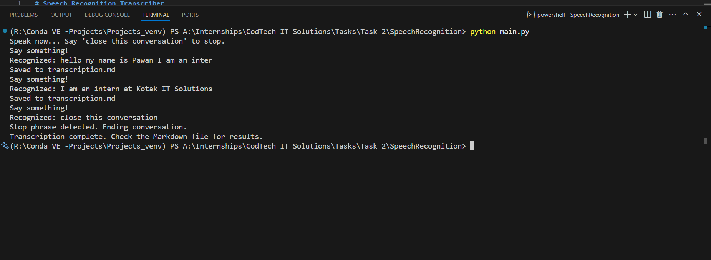

# Speech Recognition Transcriber


A simple and efficient speech recognition tool that transcribes spoken words into text and saves them in a markdown file. This application uses Google's Speech Recognition API to convert audio input into text format.

## 🌟 Features

- **Real-time Speech Recognition**: Converts spoken words into text in real-time
- **Noise Adjustment**: Automatically adjusts for ambient noise for better accuracy
- **Markdown Output**: Saves transcriptions in a clean, bullet-point format
- **Simple Exit Command**: Say "close this conversation" to stop the application
- **Error Handling**: Robust error handling for API unavailability and unrecognizable speech

## 📋 Requirements

- Python 3.x
- SpeechRecognition library
- PyAudio

## 🛠️ Installation

1. Clone this repository:
   ```bash
   git clone https://github.com/Pavansai/speech-recognition-transcriber.git
   cd speech-recognition-transcriber
   ```

2. Install the required packages:
   ```bash
   pip install -r requirements.txt
   ```

3. Install PyAudio (platform-specific):
   - Windows: `pip install PyAudio`
   - macOS: `brew install portaudio` then `pip install PyAudio`
   - Linux: `sudo apt-get install python3-pyaudio`

## 💻 Usage

1. Run the main script:
   ```bash
   python main.py
   ```

2. Wait for the "Say something!" prompt.

3. Start speaking into your microphone.

4. Say "close this conversation" when you want to end the session.

5. Check the generated `transcription.md` file for your transcribed text.


## Sample output Image:  
   

## 🚀 Applications

This speech recognition tool can be used for:

1. **Meeting Transcription**: Capture important points during meetings or lectures
2. **Content Creation**: Generate text content through speaking rather than typing
3. **Accessibility Tool**: Assist individuals with typing difficulties
4. **Note Taking**: Quick capture of ideas and thoughts
5. **Language Learning**: Practice pronunciation and receive text feedback
6. **Hands-free Documentation**: Create documentation while performing other tasks
7. **Voice Diary/Journal**: Create personal logs through speaking
8. **Dictation Software**: Use as a simple dictation tool for writing

## 📂 Project Structure

```
speech_recognition_project/
├── requirements.txt - Dependencies
├── ARCHITECTURE.md - Project architecture details
├── main.py - Main application code
└── README.md - Project documentation
```

## 🛑 Limitations

- Requires an internet connection to use Google's Speech Recognition API
- Accuracy may vary based on:
  - Microphone quality
  - Background noise
  - Accent/dialect
  - Speech clarity

## 🤝 Contributing

Contributions, issues, and feature requests are welcome! Feel free to check the [issues page](https://github.com/Pavansai20054/SPEEC-RECOGNITION-SYSTEM/issues).

## 📝 License

This project is [MIT](LICENSE) licensed.

## 👨‍💻 Author

**Pavansai**

- 📧 Email: pavansai87654321@gmail.com  
- 💼 LinkedIn: https://www.linkedin.com/in/rangdal-pavansai/  
- 🐙 GitHub: https://github.com/Pavansai
